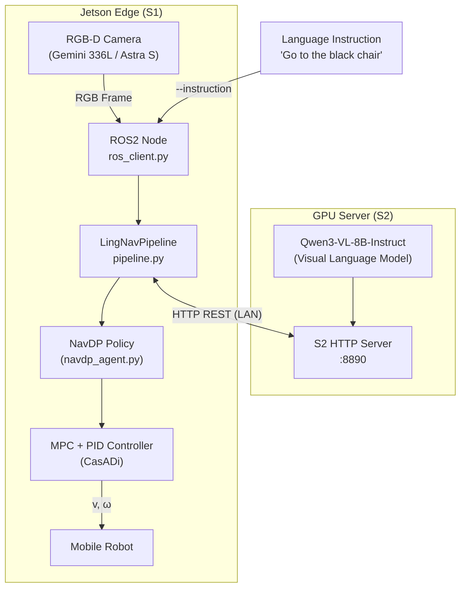
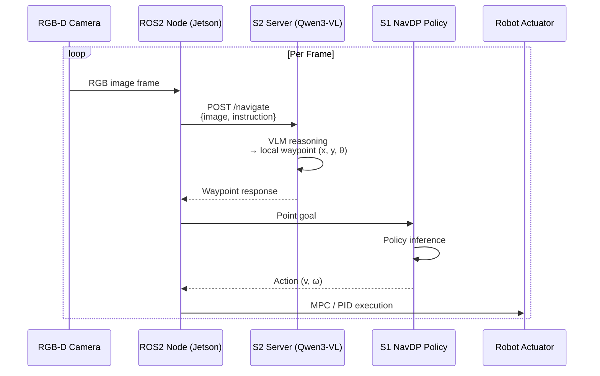
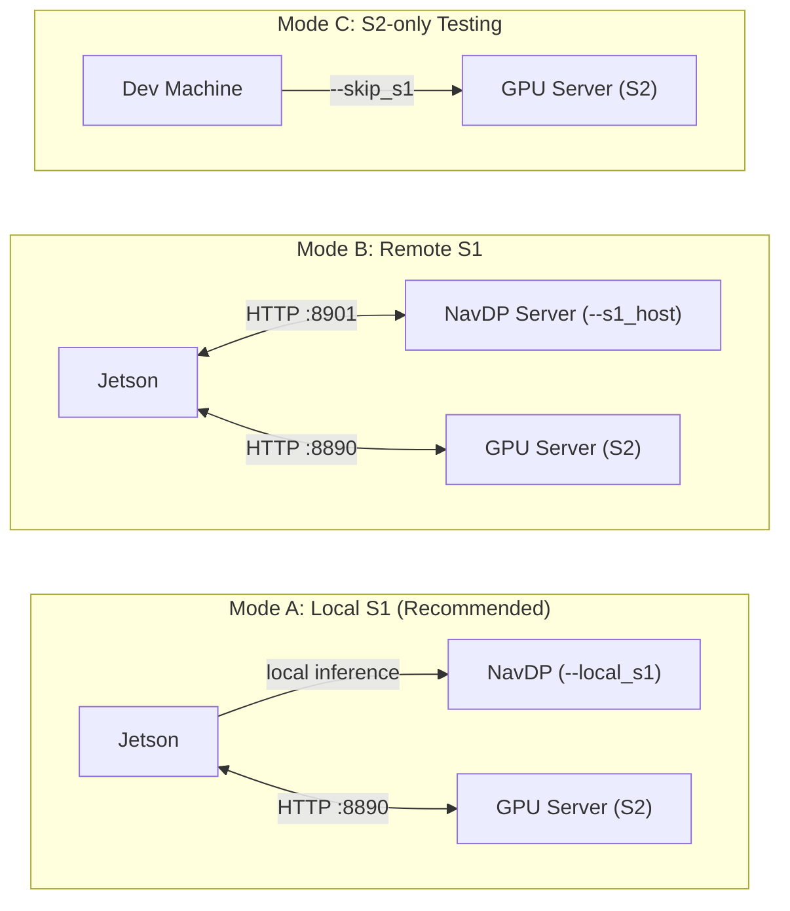

# LingNav

**LingNav** is a dual-system visual language navigation framework combining **Qwen3-VL (S2)** for language-grounded waypoint reasoning and **NavDP (S1)** for low-level motion control — designed for real-world robot deployment on Jetson edge hardware.

---

## System Architecture



### Navigation Loop



### Deployment Modes



---

## Project Structure

```
LingNav/
├── lingnav/                        # Python package (pip install -e .)
│   ├── server/
│   │   └── s2_server.py           # S2: Qwen3-VL HTTP server (port 8890)
│   ├── clients/
│   │   ├── navdp_client.py        # HTTP S1 client
│   │   └── navdp_local_client.py  # Local S1 inference (replaces HTTP client)
│   ├── core/
│   │   ├── pipeline.py            # S2+S1 orchestration (LingNavPipeline)
│   │   └── navdp_agent.py         # NavDP_Policy wrapper
│   ├── robot/
│   │   ├── ros_client.py          # Jetson ROS2 node (planning + control threads)
│   │   └── controllers.py         # MPC + PID controllers (CasADi)
│   └── utils/
│       └── thread_utils.py        # ReadWriteLock
├── tests/
│   └── test_s2_client.py          # S2 standalone test client
├── scripts/
│   ├── start_s2_server.sh         # GPU server launch script
│   └── start_jetson.sh            # Jetson launch script
├── setup.py
├── requirements_server.txt        # GPU server dependencies
└── requirements_jetson.txt        # Jetson edge dependencies
```

**NavDP dependency**: `navdp_agent.py` loads `NavDP_Policy` from a `NavDP/` directory that is a sibling of `LingNav/` (from [InternRobotics/NavDP](https://github.com/InternRobotics/NavDP)).
For example, if LingNav is at `~/VLN/LingNav`, then NavDP should be at `~/VLN/NavDP`.
Override with the environment variable: `NAVDP_ROOT=/path/to/NavDP`.

---

## Installation

### S2 Server (GPU machine running Qwen3-VL)

Reference: [QwenLM/Qwen3-VL](https://github.com/QwenLM/Qwen3-VL)

```bash
conda create -n qwen3vl python=3.10
conda activate qwen3vl

# Clone Qwen3-VL (for utility scripts)
git clone https://github.com/QwenLM/Qwen3-VL
cd Qwen3-VL

# Install PyTorch (adjust for your CUDA version; example: CUDA 12.1)
pip install torch torchvision --index-url https://download.pytorch.org/whl/cu121

# Install LingNav S2 dependencies
cd /path/to/LingNav
pip install -r requirements_server.txt

# Optional: Flash Attention for faster inference
pip install flash-attn --no-build-isolation

# Download model weights (Hugging Face)
huggingface-cli download Qwen/Qwen3-VL-8B-Instruct --local-dir /path/to/Qwen3-VL-8B-Instruct
```

### S1 Edge (Jetson running NavDP)

Reference: [InternRobotics/NavDP](https://github.com/InternRobotics/NavDP)

```bash
conda create -n navdp python=3.10
conda activate navdp

# Clone NavDP as a sibling of LingNav
cd ~/VLN
git clone https://github.com/InternRobotics/NavDP

# Install Jetson-specific PyTorch / Torchvision (prebuilt aarch64 wheel)
pip install /home/wheeltec/torchvision-0.21.0-cp310-cp310-linux_aarch64.whl

# Install NavDP model dependencies
cd ~/VLN/NavDP/baselines/navdp
pip install -r requirements.txt

# Install LingNav Jetson dependencies
cd ~/VLN/LingNav
pip install -r requirements_jetson.txt

# ROS2 packages
sudo apt install ros-humble-cv-bridge ros-humble-message-filters
```

---

## Quick Start

### 1. Start the S2 server (GPU machine)

```bash
conda activate qwen3vl

python -m lingnav.server.s2_server \
    --model_path /path/to/Qwen3-VL-8B-Instruct \
    --port 8890
```

### 2. Test S2 connectivity

```bash
conda activate qwen3vl

# Random image (connectivity test)
python tests/test_s2_client.py --host 127.0.0.1 --port 8890 \
    --random --instruction "Go to the chair"

# Real image
python tests/test_s2_client.py --host 127.0.0.1 --port 8890 \
    --image /path/to/test.jpg --instruction "Go to the door"
```

### 3. Pipeline test (S2 only, skip S1)

```bash
conda activate qwen3vl

python -m lingnav.core.pipeline \
    --s2_host 127.0.0.1 --s2_port 8890 \
    --random --skip_s1 \
    --instruction "Turn left, go to the door"
```

### 4. Full Jetson deployment (ROS2 + local S1)

```bash
conda activate navdp

cd ~/VLN/LingNav
# NavDP is auto-detected from the sibling directory; no NAVDP_ROOT needed
python -m lingnav.robot.ros_client \
    --instruction "Go to the black chair" \
    --s2_host 192.168.1.100 \
    --local_s1 \
    --s1_checkpoint /home/wheeltec/VLN/checkpoints/navdp-cross-modal.ckpt \
    --s1_half
```

### 5. Jetson with remote S1 server

```bash
conda activate navdp

python -m lingnav.robot.ros_client \
    --instruction "Go to the red chair" \
    --s2_host 192.168.1.100 \
    --s1_host 192.168.1.100 --s1_port 8901
```

### 6. Verify NavDP local import

```bash
conda activate navdp

python -c "from lingnav.clients.navdp_local_client import NavDPLocalClient; print('OK')"
```

---

## Camera Intrinsics

| Camera | Resolution | Constant |
|--------|------------|----------|
| Gemini 336L (default) | 1280×720 | `GEMINI_336L_INTRINSIC` |
| Astra S | 640×480 | `ASTRA_S_INTRINSIC` |

Switch camera (S2 server):
```bash
python -m lingnav.server.s2_server \
    --model_path /path/to/model \
    --image_width 640 --image_height 480 \
    --resize_w 640 --resize_h 480
```

---

## Acknowledgements

- [QwenLM/Qwen3-VL](https://github.com/QwenLM/Qwen3-VL) — S2 visual language model
- [InternRobotics/NavDP](https://github.com/InternRobotics/NavDP) — S1 navigation policy
